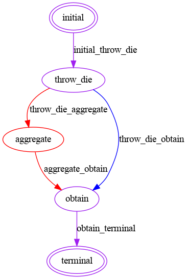

# FeatureCloud App Dice Template
The app-dice template contains four states as it is depicted in the diagram:


1. Each participant throws a die (random number between 1 and 6)
2. They then send their thrown number to the coordinator
3. The coordinator aggregates all values (calculates the sum)
4. The coordinator broadcasts the sum to all participants
5. The participants print the received sum to the log messages

For registering and testing your apps or using other apps, please visit
[FeatureCloud.ai](https://featurecloud.ai/). And for more information about FeatureCloud architecture,
please refer to 
[The FeatureCloud AI Store for Federated Learning in Biomedicine and Beyond](https://arxiv.org/abs/2105.05734) [[1]](#1).


## Developing Apps using FeatureCloud library
FeatureCloud library facilitates app development inside the FeatureCloud platform. To develop apps, developers
should define their states and register them to the default app.

### defining new states
For defining new states, in general, developers can use [`AppState`](engine/README.md#appstate-defining-custom-states)
which supports different communications, transitions, logging, and operations.

#### AppState
[`AppState`](engine/README.md#appstate-defining-custom-states) is the building block of FeatureCloud apps that covers
all the scenarios with the verifying mechanism. Each state of 
the app should extend [`AppState`](engine/README.md#appstate-defining-custom-states), which is an abstract class with two specific abstract methods:
- [`register`](engine/README.md#registering-a-specific-transition-for-state-register_transition):
should be implemented by apps to register possible transitions between the current state to other states.
This method is part of verifying mechanism in FeatureCloud apps that ensures logically eligible roles can participate in the current state
and transition to other ones.
- [`run`](engine/README.md#executing-states-computation-run): executes all operations and calls for communication between FeatureCloud clients.
`run` is another part of the verification mechanism in FeatureCloud library, that ensures the transitions to other states are logically correct
by returning the name of the next state.


### Registering apps
For each state, developers should extend one of the abstract states and call the helper function to automatically register
the state in the default FeatureCloud app:

```angular2html
@app_state(name='initial', role=Role.BOTH, app_name='example')
class ExampleState(AppState):
    def register(self):
        self.register_transition('terminal', Role.BOTH)

    def run(self):
        self.read_config()
        self.app.log(self.config)
        return 'terminal'
```

### building the app docker image
Once app implementation is done, for building the docker image for testing, or adding it to
[FeatureCloud AI store](https://featurecloud.ai/ai-store?view=store&q=&r=0),
developers should provide following files.
#### Dockerization files

For dockerizing apps, regardless of their applications, there should be some specific files:

1. [Dockerfile](Dockerfile)
2. [build.sh](build.sh)
3. [server-config](server_config)
   - [docker-entrypoint.sh](server_config/docker-entrypoint.sh)
   - [nginx](server_config/nginx)
   - [supervisord.conf](server_config/supervisord.conf)

Developers should ensure that these files with same structure and content are exist in the same directory as their app
implementation. 


#### App-specific files
All app-specific files should be included data or codes that are strictly dependent to app's functionality.

##### main.py
Each app should be implemented in a directory that includes the [`main.py`](main.py) file which in turn includes either direct
implementation of states or importing them. Moreover, `main` should import `bottle` and `api` package:
```angular2html
from bottle import Bottle

from api.http_ctrl import api_server
from api.http_web import web_server

import apps.examples.dice

from engine.app import app

server = Bottle()
```
Here we imported `dice` app from our [`apps`](apps/README.md) package which because of putting 
[`app_state`](engine/README.md#registering-states-to-the-app-app_state) on top of state classes, 
merely importing the states register them into the [`app` instance](engine/README.md#app-instance).     

For running the app, inside a docker container, [`app.register()`](engine/README.md#registering-all-transitions-appregister)
should be called to register and verify all transitions; next, api and servers should mount at corresponding paths; and finally
server is ready to run the app.

```angular2html
    app.register()
    server.mount('/api', api_server)
    server.mount('/web', web_server)
    server.run(host='localhost', port=5000)
```

All of aforementioned codes, except for importing the app, or alternatively, implementing states, can be exactly same for all apps.  

##### requirements.txt
for installing required python libraries inside the docker image, developers should provide a list of libraries in [requirements.txt](requirements.txt).
Some requirements are necessary for FeatureCloud library, which should always be listed, are:
```angular2html
bottle
jsonpickle
joblib
numpy
bios
pydot
pyyaml
```

And the rest should be all other app required libraries.

##### config.yml
Each app may need some hyper-parameters or arguments that should be provided by the end-users. Such data should be included
in [`config.yml`](apps/README.md#config-file) which should be read and interpreted by the app. 

### References
<a id="1">[1]</a> 
Matschinske, J., Späth, J., Nasirigerdeh, R., Torkzadehmahani, R., Hartebrodt, A., Orbán, B., Fejér, S., Zolotareva,
O., Bakhtiari, M., Bihari, B. and Bloice, M., 2021.
The FeatureCloud AI Store for Federated Learning in Biomedicine and Beyond. arXiv preprint arXiv:2105.05734.
